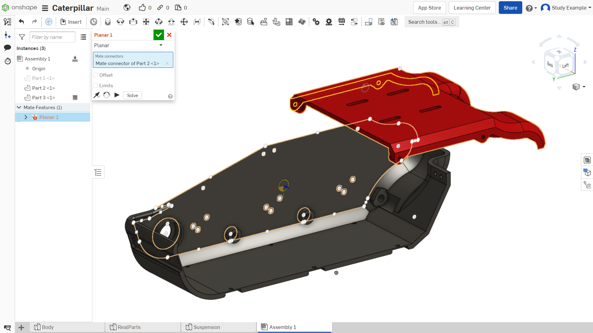

Лабораторная работа №12
=========================

Создание сборки

Для начала необходимо перейти в раздел сборки – «Assembly». Если у вас он отсутствует, то добавьте его, нажав на «+», как показано на рисунке 1.

.. figure:: _static/Pictures/lab12/Рисунок1.png
       :scale: 100 %
       :align: center
       :alt: Раздел «Assembly»

       Рисунок 1 - Раздел «Assembly»

Далее необходимо добавить элементы в сборку, как показано на рисунках 2-3. Для этого:

1) Нажимаем на «Insert»;
2) Разворачиваем список деталей «Body»;
3) Выбираем необходимые нам детали. В данном случае выберем первые три. Переместите курсор мыши на поле сборки и нажмите ЛКМ. Для подтверждения вставки нажмите на зеленую галочку.

.. figure:: _static/Pictures/lab12/Рисунок2.png
       :scale: 35 %
       :align: center
       :alt: Добавление деталей в сборку

       Рисунок 2 - Добавление деталей в сборку

.. figure:: _static/Pictures/lab12/Рисунок3.png
       :scale: 35 %
       :align: center
       :alt: Добавление деталей в сборку

       Рисунок 3 - Добавление деталей в сборку

Теперь закрепим большую черную деталь «Part3». В панели вставленных деталей нажимаем ПКМ на деталь 3 и нажимаем на «FIX». Это зафиксирует данную деталь. Это делается для того, чтобы в дальнейшем «привязывать» с помощью зависимостей к ней другие детали.

Иллюстрация на рисунке 4.

Зависимости — это связи между деталями, определяющие степени их свободы. Они необходимы для создания сборки с различными степенями свободы.

.. figure:: _static/Pictures/lab12/Рисунок4.png
       :scale: 35 %
       :align: center
       :alt: Фиксирование элемента

       Рисунок 4 - Фиксирование элемента

Можете попробовать «подвигать» детали с зажатой на них ЛКМ. Если же просто нажать по детали, появятся элементы для более точного перемещения и поворотов:

1) Движение вдоль одной оси;
2) Поворот детали на определенный угол;
3) Перемещение детали в одной плоскости.

Иллюстрация на рисунках 5–6.

.. figure:: _static/Pictures/lab12/Рисунок5.png
       :scale: 35 %
       :align: center
       :alt: Перемещение детали

       Рисунок 5 - Перемещение детали

.. figure:: _static/Pictures/lab12/Рисунок6.png
       :scale: 35 %
       :align: center
       :alt: Перемещение детали

       Рисунок 6 - Перемещение детали

Далее необходимо закрепить детали относительно друг друга. Для этого в верхней панели есть множество инструментов, позволяющих делать привязки с различной степенью свободы. Для создания первых зависимостей выберем инструмент «Planar mate», он создает зависимость между плоскостями разных объектов:

1) Выберем инструмент “Planar mate”;
2) Выберем плоскость как показано на рисунке 7.

       Рисунок 7 - Инструмент «Planar mate»

Обратите внимание на то, чтобы плоскость подсвечивалась точно так же, как на рисунке 8.

       Рисунок 8 - Проверка

Теперь аналогично выберем плоскость на черной детали, как показано на рисунке 9.

.. figure:: _static/Pictures/lab12/Рисунок9.png
       :scale: 35 %
       :align: center
       :alt: Выбор плоскости

       Рисунок 9 - Выбор плоскости

Как можно вспомнить, при разрезании детали мы оставляли зазор 0.2 мм, нам нужно соблюсти его в сборке:

1) Активируем «Offset»;
2) Задаем расстояние «-0.2». Наши плоскости как раз будут на расстоянии 0.2 мм друг от друга.

Аналогично создадим следующую зависимость между следующими плоскостями, как показано на рисунках 10–11. Не забываем про зазоры.

.. figure:: _static/Pictures/lab12/Рисунок10.png
       :scale: 35 %
       :align: center
       :alt: Плоскости, между которыми создаем зависимости

       Рисунок 10 - Плоскости, между которыми создаем зависимости

.. figure:: _static/Pictures/lab12/Рисунок11.png
       :scale: 95 %
       :align: center
       :alt: Плоскости, между которыми создаем зависимости

       Рисунок 11 - Плоскости, между которыми создаем зависимости

Создаем третью зависимость для нашей пары деталей. Выделяем 2 плоскости, как показано на рисунках 12–13, но здесь не нужно задавать зазор, т. к. выделенные стороны компланарны (т. е. находятся в одной плоскости).

.. figure:: _static/Pictures/lab12/Рисунок12.png
       :scale: 35 %
       :align: center
       :alt: Плоскости, между которыми создаем зависимости

       Рисунок 12 - Плоскости, между которыми создаем зависимости

.. figure:: _static/Pictures/lab12/Рисунок13.png
       :scale: 95 %
       :align: center
       :alt: Плоскости, между которыми создаем зависимости

       Рисунок 13 - Плоскости, между которыми создаем зависимости

После выделения детали могут съехать, не переживайте, просто подтверждаем создание зависимости. Готово, теперь две детали взаимосвязаны (рисунок 14).

       Рисунок 14 - Две взаимосвязанные детали

Аналогично создайте зависимости между плоскостями как показано на рисунке 15. Зазор 0.2 мм.

.. figure:: _static/Pictures/lab12/Рисунок15.png
       :scale: 35 %
       :align: center
       :alt: Плоскости, между которыми создаем зависимости

       Рисунок 15 - Плоскости, между которыми создаем зависимости

.. figure:: _static/Pictures/lab12/Рисунок16.png
       :scale: 35 %
       :align: center
       :alt: Плоскости, между которыми создаем зависимости

       Рисунок 16 - Плоскости, между которыми создаем зависимости

Итого, следующая деталь должна жестко закрепиться в положении, как показано на рисунке 17. Обратите Внимание: сейчас должно быть 6 взаимосвязей, если их меньше, значит у какой-то детали останется степень свободы по одному из направлений.

       Рисунок 17 - Результат создания зависимостей

Далее добавим в сборку шаговый двигатель, как показано на рисунке 18.

       Рисунок 18 - Добавление шагового двигателя

Теперь добавим зависимость «Revolute mate»:

1) Выбираем создание нужной зависимости;
2) Выделяем окружность как показано на рисунке 19.

.. figure:: _static/Pictures/lab12/Рисунок19.png
       :scale: 35 %
       :align: center
       :alt: Выделяемая окружность

       Рисунок 19 - Выделяемая окружность

.. figure:: _static/Pictures/lab12/Рисунок20.png
       :scale: 35 %
       :align: center
       :alt: Лаб12

       Рисунок 20 

И выбираем вторую окружность на черной корпусной детали (эта зависимость позволяет создать связь между круглыми объектами, позволяя создать вращательную степень свободы).

.. figure:: _static/Pictures/lab12/Рисунок21.png
       :scale: 35 %
       :align: center
       :alt: Лаб12

       Рисунок 21 

После деталь может повернуть в противоположную сторону от того как нужно.

1-Нажимаем на стрелочку, для того чтобы изменилась ориентация детали на 180 градусов;
2-Подтверждаем создание зависимости.

       Рисунок 22 

Теперь установим шаговый двигатель в необходимом положении с помощью зависимости “Parallel mate”

1.Выбираем инструмент;
2.Выбираем плоскость двигателя;
3.Выбираем ребро второй детали.

Подтверждаем создание зависимости.

       Рисунок 23 

Теперь необходимо создать крепежные отверстия для двигателя. В onshape можно редактировать детали, вставленные в сборку с видимостью других элементов этой сборки.
Для этого дважды нажмите ЛКМ по детали (Part 3).

.. figure:: _static/Pictures/lab12/Рисунок24.png
       :scale: 35 %
       :align: center
       :alt: Лаб12

       Рисунок 24

       